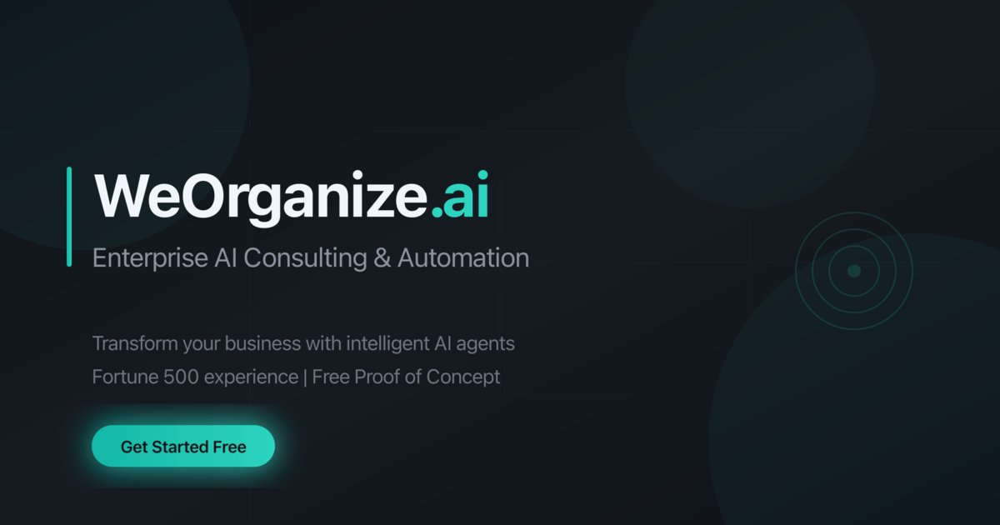

<div align="center">

# 🤖 WeOrganize.ai

### Enterprise AI Consulting & Automation Solutions

[](https://www.weorganize.ai)
[](https://vercel.com)
[](https://www.typescriptlang.org/)
[](https://react.dev/)
[](LICENSE)

<br/>

**Transform your business with intelligent AI agents and automation.**

*Built by Fortune 500 veterans with 16+ years experience at ADP, AT&T, Barclays & Bank of America*

<br/>

[🌐 View Live Site](https://www.weorganize.ai) · [📧 Contact Us](mailto:hr@weorganize.ai) · [💼 LinkedIn](https://linkedin.com/company/weorganize-ai)

<br/>



</div>

---

## ✨ Features

<table>
<tr>
<td width="50%">

### 🎨 Modern Design
- Clean, responsive UI
- Dark/Light mode support
- Smooth animations
- Mobile-first approach

</td>
<td width="50%">

### 🔍 SEO Optimized
- Comprehensive meta tags
- JSON-LD structured data
- XML & HTML sitemaps
- Open Graph & Twitter cards

</td>
</tr>
<tr>
<td width="50%">

### 🤖 AI-Ready (AEO/GEO)
- llms.txt for AI crawlers
- FAQ schema for voice search
- Speakable content markup
- Entity optimization

</td>
<td width="50%">

### 📊 Analytics & Tracking
- Google Analytics 4
- Microsoft Clarity heatmaps
- Custom event tracking
- Conversion optimization

</td>
</tr>
<tr>
<td width="50%">

### ⚡ Performance
- Vite for fast builds
- Code splitting & lazy loading
- CDN caching via Vercel
- Core Web Vitals optimized

</td>
<td width="50%">

### 🔒 Compliance
- GDPR/CCPA ready
- Cookie consent banner
- Accessibility (WCAG 2.1 AA)
- Privacy & Terms pages

</td>
</tr>
</table>

---

## 🛠️ Tech Stack

<div align="center">

| Frontend | Backend | DevOps | Analytics |
|:--------:|:-------:|:------:|:---------:|
|  |  |  | GA4 |
|  | Edge Functions | GitHub Actions | Clarity |
|  | PostgreSQL | CI/CD | Vercel Analytics |
|  | REST API | SSL/HTTPS | Event Tracking |

</div>

<details>
<summary><b>📦 All Dependencies</b></summary>

**Core:**
- React 18.3 + React Router 6
- TypeScript 5.6
- Vite 7.3
- Tailwind CSS 3.4

**UI Components:**
- [shadcn/ui](https://ui.shadcn.com/) - Component library
- [Radix UI](https://www.radix-ui.com/) - Accessibility primitives
- [Lucide](https://lucide.dev/) - Icon library

**Data & Forms:**
- [TanStack Query](https://tanstack.com/query) - Data fetching
- [React Hook Form](https://react-hook-form.com/) - Form handling
- [Zod](https://zod.dev/) - Schema validation

**Backend:**
- [Supabase](https://supabase.com/) - Database & Auth
- Edge Functions - Serverless APIs

</details>

---

## 📁 Project Structure

```
weorganize.ai/
├── 📁 public/
│   ├── 📁 logos/              # Brand assets
│   ├── 📁 .well-known/        # Security & AI files
│   ├── 📄 sitemap.xml         # XML sitemap (28 URLs)
│   ├── 📄 robots.txt          # Crawler directives
│   ├── 📄 llms.txt            # AI crawler info
│   └── 📄 og-image.png        # Social preview
│
├── 📁 src/
│   ├── 📁 components/         # React components
│   │   ├── 📁 ui/            # shadcn/ui components
│   │   └── 📁 layouts/       # Page layouts
│   ├── 📁 pages/             # Route pages
│   │   └── 📁 industries/    # Vertical pages
│   ├── 📁 hooks/             # Custom hooks
│   ├── 📁 lib/               # Utilities
│   │   └── 📄 analytics.ts   # Event tracking
│   ├── 📁 data/              # Static data
│   └── 📁 integrations/      # Third-party
│
├── 📁 supabase/              # Edge functions
├── 📄 index.html             # Entry + SEO schemas
└── 📄 vercel.json            # Deployment config
```

---

## 🚀 Quick Start

### Prerequisites

- Node.js 18+ or Bun
- npm / yarn / bun

### Installation

```bash
# Clone the repo
git clone git@github.com:weorganize/website.git
cd website

# Install dependencies
npm install

# Set up environment
cp .env.example .env

# Start dev server
npm run dev
```

### Environment Variables

```env
VITE_SUPABASE_URL=your_supabase_url
VITE_SUPABASE_ANON_KEY=your_supabase_anon_key
```

### Commands

| Command | Description |
|---------|-------------|
| `npm run dev` | Start development server |
| `npm run build` | Build for production |
| `npm run preview` | Preview production build |
| `npm run lint` | Run ESLint |

---

## 📄 Pages

| Page | Route | Description |
|------|-------|-------------|
| Home | `/` | Landing page with hero, services, testimonials |
| Services | `/services/*` | AI Solutions, Custom Dev, Analytics, Cloud |
| Industries | `/industries/*` | Healthcare, Finance, Retail, Manufacturing |
| Resources | `/blog`, `/case-studies` | Blog posts, success stories |
| Company | `/about`, `/team`, `/careers` | About us, team, job openings |
| Tools | `/roi-calculator`, `/compare` | Interactive tools |
| Legal | `/privacy`, `/terms`, `/cookies` | Legal pages |
| Trust | `/ai-ethics`, `/data-handling`, `/accessibility` | Trust & compliance |

---

## 🔧 Configuration

### Analytics Setup

| Tool | ID | Status |
|------|-----|--------|
| Google Analytics 4 | `G-07F8K4LWKM` | ✅ Active |
| Google Tag Manager | `GTM-TS77H6TV` | ✅ Active |
| Microsoft Clarity | `v178o42mzb` | ✅ Active |

### Database (Supabase)

| Table | Purpose |
|-------|---------|
| `leads` | Contact form submissions |
| `subscribers` | Newsletter signups |

```sql
-- Create subscribers table
CREATE TABLE subscribers (
  id UUID PRIMARY KEY DEFAULT gen_random_uuid(),
  email VARCHAR(255) NOT NULL UNIQUE,
  source VARCHAR(100) DEFAULT 'website',
  status VARCHAR(20) DEFAULT 'active',
  subscribed_at TIMESTAMP WITH TIME ZONE DEFAULT NOW()
);
```

### SEO Schemas Included

- ✅ Organization
- ✅ WebSite with SearchAction
- ✅ ProfessionalService
- ✅ FAQPage
- ✅ HowTo
- ✅ Speakable
- ✅ Breadcrumb (dynamic)
- ✅ Article (blog posts)

---

## 🚢 Deployment

Automatically deployed to **Vercel** on push to `main`.

[](https://vercel.com/new/clone?repository-url=https://github.com/weorganize/website)

```bash
# Manual deployment
npm i -g vercel
vercel --prod
```

---

## 🤝 Contributing

We welcome contributions! See [CONTRIBUTING.md](CONTRIBUTING.md) for guidelines.

```bash
# Fork & clone
git checkout -b feature/your-feature
git commit -m "Add your feature"
git push origin feature/your-feature
# Open a PR
```

---

## 📜 License

This project is licensed under the **MIT License** - see [LICENSE](LICENSE) for details.

---

## 📞 Contact

<div align="center">

| | |
|:-:|:-:|
| 🌐 **Website** | [www.weorganize.ai](https://www.weorganize.ai) |
| 📧 **Email** | [hr@weorganize.ai](mailto:hr@weorganize.ai) |
| 💼 **LinkedIn** | [WeOrganize AI](https://linkedin.com/company/weorganize-ai) |

<br/>

---

<br/>

**Built with 💚 by the WeOrganize.ai Team**

*Reorganizing the Future with AI Agents*

</div>
